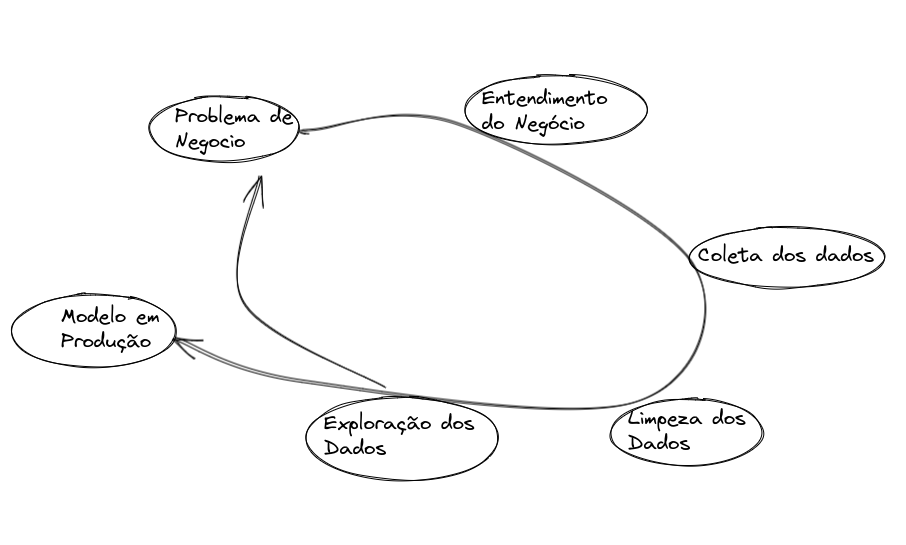
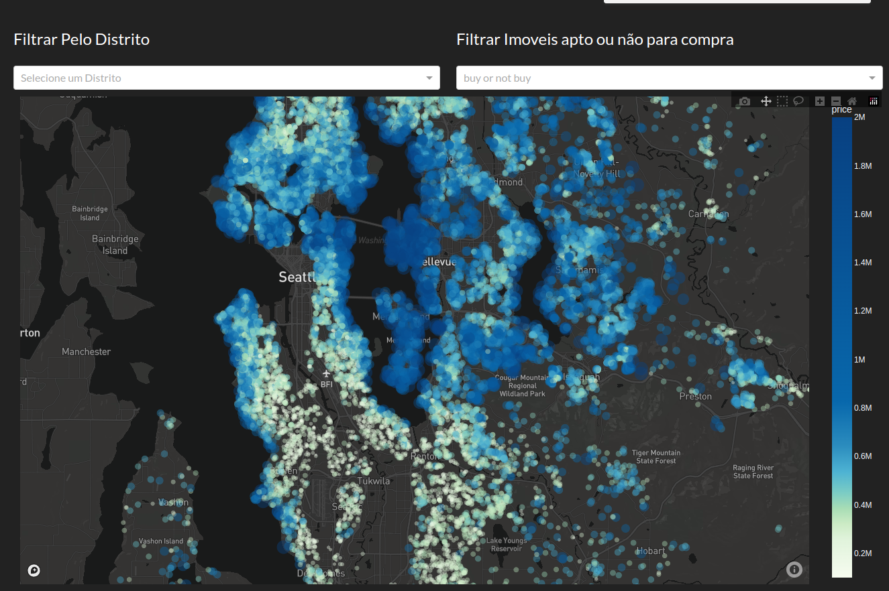

# Project Insights – House Rocket

## 1. Problema de Negócio

A House Rocket é uma plataforma digital que tem como modelo de negócio, a compra e a venda de imóveis usando tecnologia. O CEO da House Rocket gostaria de maximizar a receita da empresa encontrando boas oportunidades de negócio.

Sua principal estratégia é comprar boas casas em ótimas localizações com preços baixos e depois revendê-las posteriormente à preços mais altos. Quanto maior a diferença entre a compra e a venda, maior o lucro da empresa e, portanto, maior sua receita.

Entretanto, as casas possuem muitos atributos que as tornam mais ou menos atrativas aos compradores e vendedores e a localização e o período do ano também podem influenciar os preços.

Desenvolvi uma análise exploratória buscando identificar casas com potencial de compra e venda conforme regras de negócio. Além disso desenvolvi um site hospedado em Cloud para que o time de negócio possa realizar filtros e visualizar os dados, assim como também a localização de cada imóvel.

## 2. Suposições de Negócio.

Segue as suposições que foram levantadas para este problema de negócio.

- Id’s repetidos serão mantidos para a análise exploratória caracterizando imóveis sendo anunciados em dias diferentes. Para os relatórios foram descartados id’s duplicados com o objetivo de melhorar a experiência do time de negócios em suas análises.

- Os andares de cada imóvel foram tratados como números inteiros, números flutuantes serão arredondados ao número inteiro anterior.

## Atributos dos Imóveis

 Atributos                  |  Descrição dos dados  |
 -------------------        | ------------------- |
|    id                      |  Identificador de anúncio para cada propriedade. |
|    date                    |  Data em que a propriedade ficou disponível.
|    price                   |  O preço anunciado de cada imóvel. |
|    bedrooms                |  O número de banheiros, sendo os valores 0,5 o indicador de um quarto com banheiro, mas sem chuveiro, já o valor 0,75 ou 3/4 representa um banheiro que contém uma pia, um vaso sanitário e um chuveiro ou banheira. |
|    sqft_lot	            |  Pés quadrados do terreno das casas.   |
|    sqft_living	            |  Pés quadrados do interior das casas.   |
|    floors	                |  Número de andares.   |
|    waterfront	            |  Variável indicadora para imóveis com visualização ao mar (1) ou não (0).   |
|    view	                |  Um índice de 0 a 4 de quão boa era a visualização da propriedade.   |
|    condition	            |  PUm índice de 1 a 5 sobre o estado das moradias, 1 indica propriedade degradada e 5 excelente.  |
|    grade	                |  Uma nota geral é dada à unidade habitacional com base no sistema de classificação de King County. O índice de 1 a 13, onde 1-3 representa baixo |nível da qualidade de construção e design do edifício, 7 tem um nível médio de construção e design e 11-13 tem um nível de construção e design de alta qualidade.  |
|    sqft_above	            |  Os pés quadrados do espaço habitacional interior acima do nível do solo.   |
|    sqft_basement	        |  Os pés quadrados do espaço habitacional interior abaixo do nível do solo.   |
|    yr_built	            |  Ano de construção da propriedade.  |
|   yr_renovated	        |  Representa o ano em que o imóvel foi reformado. Considera o número ‘0’ para descrever as propriedades nunca renovadas.   |
|   zipcode	                |  Um código de cinco dígitos, similar ao CEP, para indicar a área onde se encontra a propriedade.   |
|   lat	                    |  Coordenada de Latitude.   |
|   long	                |  Coordenada de Longitude.   |
|   sqft_living15	        |  O tamanho médio em pés quadrados do espaço interno de habitação para as 15 casas mais próximas.   |
|   sqft_lot15	            |  Tamanho médio dos terrenos em metros quadrados para as 15 casas mais próximas.   |

## Soluçao

Conversando com o time de Negocio, ficou alinhado que precisaria criar duas estrategias, uma de compra e outra de venda.

A estrutura de recomendação de compra leva em consideração a mediana de preço do imóvel por região. Imóveis com com preço abaixo da mediana e estando em boas condições e avaliações serão recomendados.

A estrutura utilizada para a venda de imóveis considera a mediana do preço de imóveis e a sazonalidade (temporada) do ano, estes atributos permitem recomendar vendas com base na mediana de preço da região e os melhores meses para anunciar.

Os relatórios foram disponibilizados em Excel, mas para melhor comodidade a equipe de negócio, também foi entregue um site que permita filtrar as informações no relatório. 

O resultado se encontra no link abaixo:
<http://dashapphouse-env.eba-ttdiru7x.us-east-1.elasticbeanstalk.com/>

## Estratégia da Solução

Estratégia para resolver esse desafio foi:

Step 01. Data Description: Realizar limpeza e identificar outliers que comprometam a análise dos dados.

Step 02. Feature Engineering: Derivar novos atributos com base nas variáveis originais para descrever melhor o fenômeno a ser compreendido.

Step 03. Exploratory Data Analysis: Explorar os dados para encontrar insights e entender melhor o impacto das variáveis.

Step 04. Business Value: Transcrever a análise produzida em um resultado de negócio.

Step 05. Deploy Model to Production: Publicar os relatórios em um ambiente web para que outras pessoas ou serviços possam usar os resultados para melhorar a decisão de negócios.

## Resultado da Estratégia

Os relatórios gerados permitem a equipe de negócios consultar imóveis indicados para compra e venda com a seguinte previsão de faturamento:

   Totais de Compras        |  Totais de Vendas    | Lucro Bruto        |
 -------------------        | -------------------  |------------------- |
|    $ 3.535.777.760,00     | 4.561.543.361,20     | 1.025.765.601,20   |

O resultado corresponde a 8.578 imóveis recomendado para compra com um lucro por imóvel de aproxidamente $ 119.580,97.

Em contra partida aos realizar a compra de todos os imóveis indicado traria o seguinte resultado:

 Totais de Compras         |  Totais de Vendas    | Lucro Bruto |
  -------------------      | -------------------  |------------------- 
|   11.610.168.601,00      | $ 13.611.834.574,50  | $ 2.001.665.973,50 |

Este resultado corresponde a 21.435 com um lucro por imóvel de aproximadamente $ 93.383,06.

A comparação entre os resultados destaca que utilizar a abordagem de compra com base nos indicadores apontados no relatório permite um aumento do lucro de aproximadamente 28,05% por imóvel com um custo total aproximado de 228,36% a menos.

## Produto de Dados

Para que a equipe de análise de negócios possa ter acesso ao relatório e realizar filtros permitindo identificar os melhores imóveis foi disponibilizado um site hospedado nos serviços Cloud da Heroku. Também consta um mapa que possibilite a rápida localização do imóvel.

## Conclusões

Podemos concluir que o resultado, para um primeiro ciclo de desenvolvimento, se mostra satisfatório. Foi possível após uma coleta de dados e uma análise completa, identificar um potencial de ganho de aproximadamente 28%.

## Próximos Passos

Um segundo ciclo de desenvolvimento é indicado para otimizar a estrutura de análise e melhorar a performance dos ganhos, também possibilita observar o problema de diferentes ângulos identificando Insights antes não observados.

Tópicos a serem explorados:

- Elaborar um novo plano de recomendação de compras e vendas dos imóveis através da aplicação de Machine Learning.

- Identificar novos Insights que possuem grande correlação para o preço.

- Otimizar a resposta de informações disponíveis no site melhorando a experiência de usuário.

- Disponibilizar novos filtros para os dados gerados no site para melhorar a análise do time de negócios.

